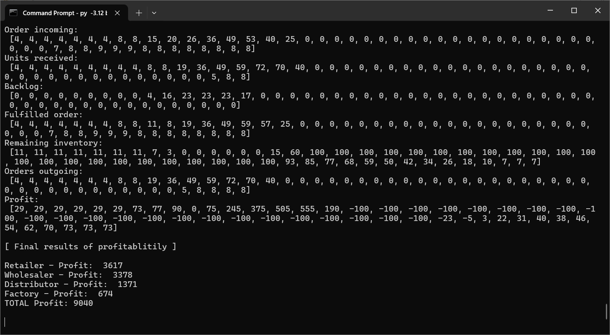
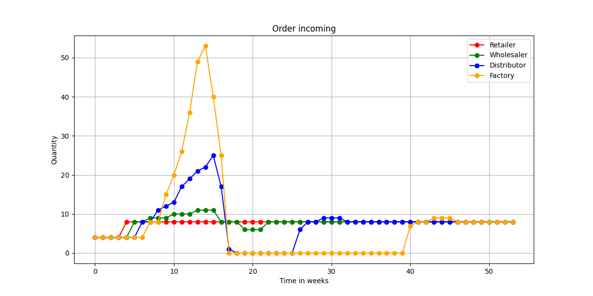
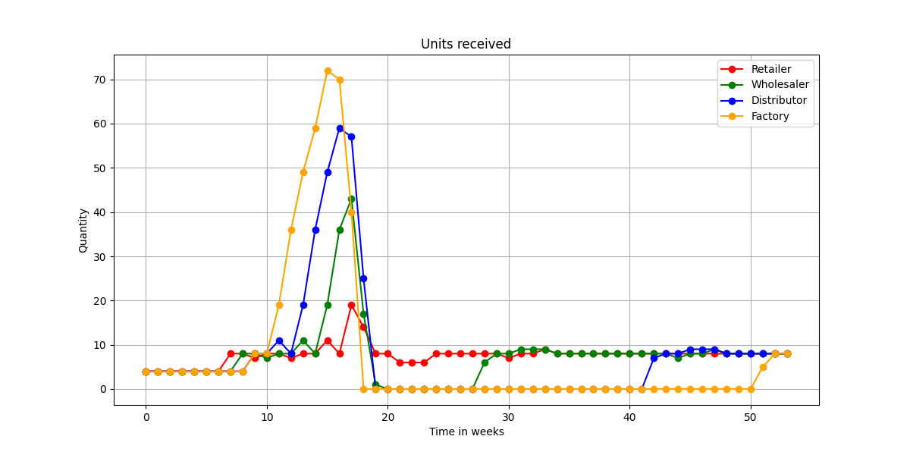
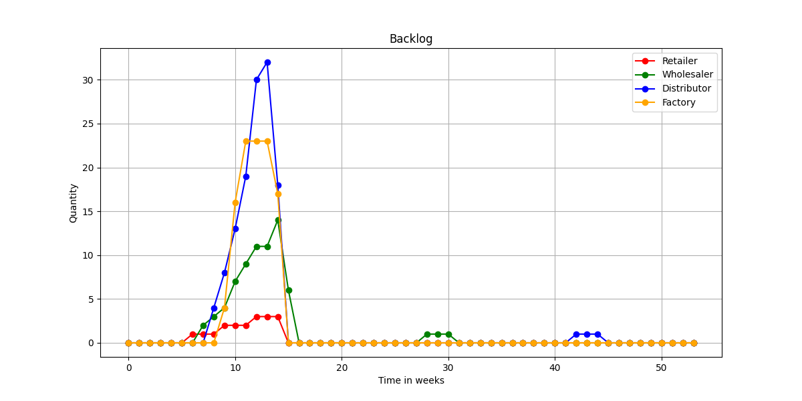
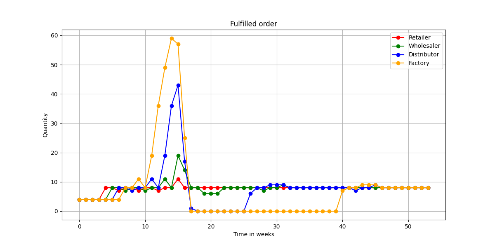
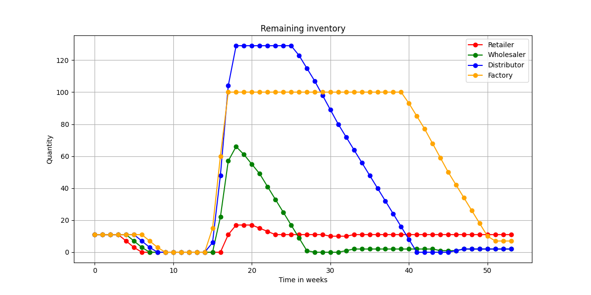
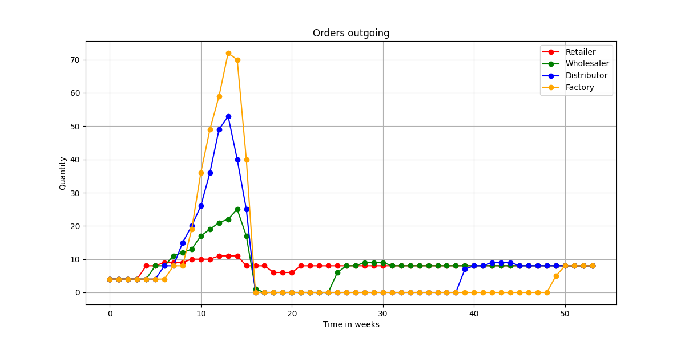
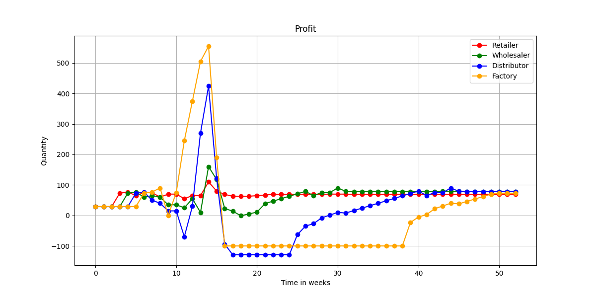

# beer.py

This is a simulation in python of the famous MIT Beer Distribution Game, invented by Jay Wright Forrester at the MIT Sloan School of Management in 1960. The Beer Distribution Game is an excellent educational game that is used to experience typical coordination problems of a supply chain with four actors.

Control the number of rounds, the delivery time, inventory and more, and try to avoid the bullwhip effect if you can while maximizing profit! 
This python script needs matplotlib, which can be installed using pip. 

Screenshots: 

